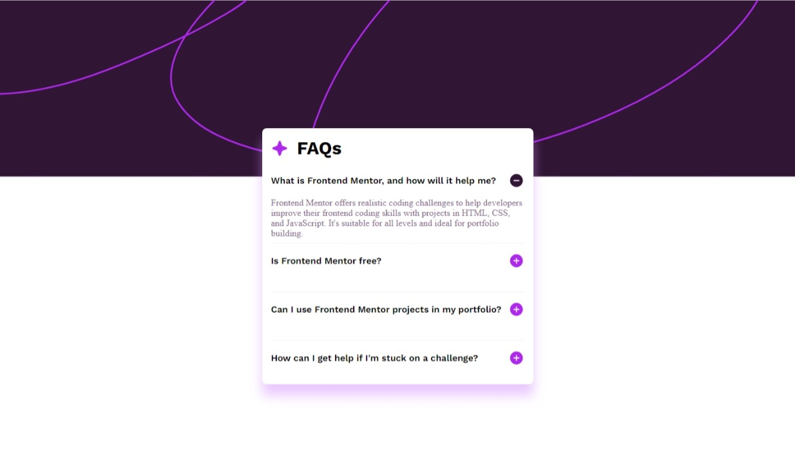

# Frontend Mentor - FAQ accordion

## Welcome! 👋

Thanks for checking out this front-end coding challenge.

[Frontend Mentor](https://www.frontendmentor.io) challenges help you improve your coding skills by building realistic projects.
## Table of contents

- [Overview](#overview)
  - [The challenge](#the-challenge)
  - [Screenshot](#screenshot)
  - [Links](#links)
- [My process](#my-process)
  - [Built with](#built-with)
  - [What I learned](#what-i-learned)
  - [Continued development](#continued-development)
  - [Useful resources](#useful-resources)
- [Author](#author)
- [Acknowledgments](#acknowledgments)

## Overview

### The challenge
One challenge I had was adding the `JS` component to make the text show/hide
Thanks to [W3C](https://www.w3schools.com/howto/howto_js_accordion.asp). They have provide a guide to solving this problem

### Screenshot

### Links

- Solution URL: [on github](https://github.com/DR-KSP-VIRUS/faq-accordion-main.git)
- Live Site URL: [on vercel](https://faq-accordion-main-lovat.vercel.app/)

## My process

### Built with

- Semantic HTML5 markup
- CSS custom properties
- Flexbox
- Mobile-first workflow

### What I learned

I am very excited about the dynamic content I was able to add using `Js`.
I have learnt alot about `DOM` content manipulation offered by `Js`

### Continued development
I want to dive into dynamic content development with `reactJs`

## Useful resources
Good tutorial about web development can be found here [W3C](https://www.w3schools.com/)

## Author

- Website - [vercel app](https://faq-accordion-main-lovat.vercel.app/)
- Frontend Mentor - [@DR-KSP-VIRUS](https://www.frontendmentor.io/profile/DR-KSP-VIRUS)

## Acknowledgments

I want to thank [W3C](https://www.w3schools.com/howto/howto_js_accordion.asp) for their guide to solving this problem.